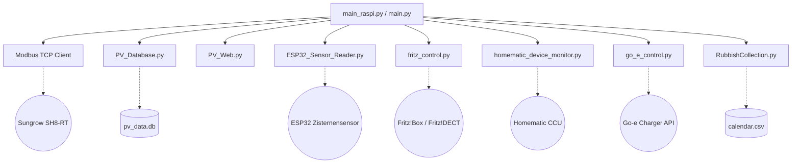

# Projektanalyse: Sungrow Inverter & Heimzentrale

Dieses Projekt ist ein modulares, in Python geschriebenes System zur Überwachung und intelligenten Steuerung eines Smart Homes. Der Kern des Systems basiert auf dem Auslesen eines **Sungrow SH8-RT Hybrid-Wechselrichters** über Modbus TCP sowie der Integration verschiedener Smart-Home-Komponenten.

---

## 1. Systemübersicht & Architektur

Das Projekt unterstützt zwei Betriebsmodi:
1. **Desktop-Modus (`main.py`)**: Startet einen Webserver und eine grafische Benutzerozerfläche (Tkinter) zur lokalen Überwachung.
2. **Raspberry-Pi-Modus (`main_raspi.py`)**: Läuft headless (ohne GUI) als kontinuierlicher Hintergrunddienst mit erweiterten Smart-Home-Integrationen.

### Systemarchitektur

---

## 2. Kern-Komponenten

### A. Modbus TCP & Inverter-Auslesung
* **Dateien**: [main.py](file:///Users/stephan/Python/SungrowInverter/main.py), [main_raspi.py](file:///Users/stephan/Python/SungrowInverter/main_raspi.py), [registers.json](file:///Users/stephan/Python/SungrowInverter/registers.json)
* **Funktionsweise**:
  * Liest über die Bibliothek `pymodbus` Register des Wechselrichters aus.
  * Unterstützt verschiedene Datentypen (`uint16be`, `int16be`, `uint32sw`, `int32sw` für Word-Swapped 32-Bit-Werte).
  * Hat eine robuste Fehlerbehandlung (bis zu 3 Leseversuche mit automatischem Reconnect bei Verbindungsverlust).
  * Liest Daten wie PV-Erzeugung, Netzbezug/Einspeisung und Batterie-SOC aus.

### B. Datenbank & Aufzeichnung
* **Datei**: [PV_Database.py](file:///Users/stephan/Python/SungrowInverter/PV_Database.py)
* **Funktionsweise**:
  * Verwendet eine SQLite-Datenbank (`pv_data.db`).
  * Nutzt den **WAL-Modus** (Write-Ahead Logging), der gleichzeitiges Lesen (z.B. durch Visualizer/Webseite) und Schreiben (durch den Logger-Dienst) ohne Sperrkonflikte erlaubt.
  * Daten werden sekündlich abgefragt, im Speicher gepuffert und alle 60 Sekunden als **Mittelwert** in die Datenbank geschrieben, um Speicherplatz zu sparen.
  * Dynamische Generierung der Tabelle `readings` basierend auf den Keys in `registers.json`.

### C. Webserver & Frontend
* **Datei**: [PV_Web.py](file:///Users/stephan/Python/SungrowInverter/PV_Web.py)
* **Funktionsweise**:
  * Basiert auf Pythons standardmäßiger `http.server`-Bibliothek.
  * Läuft asynchron über einen Threading-MixIn (`ThreadedHTTPServer`), damit HTTP-Anfragen die Modbus-Abfragen nicht blockieren.
  * Bietet eine REST-API unter `/api` für Live-Daten und `/api/history` für Verlaufsdaten.
  * Liefert statische HTML-Seiten für die Visualisierung aus:
    * `index.html`: Dashboard / Hub mit integrierter SVG-Bahnhofsuhr, Open-Meteo Wettervorhersage und Kachel-Navigation.
    * `pv.html`: PV-Leistung und Batteriestatus.
    * `charge.html`: Steuerung des E-Autos.
    * `windows.html`: Fensterstatus (Homematic).
    * `heating-cooling.html`: Heizungs- und Klimageräte.
    * `others.html`: Fritz!DECT-Steckdosen und Zisternenwerte.
    * `history.html`: Diagramme (Chart.js) der historischen Daten.

### D. Desktop-Visualisierung
* **Dateien**: [PV_UI.py](file:///Users/stephan/Python/SungrowInverter/PV_UI.py), [PV_Visualizer.py](file:///Users/stephan/Python/SungrowInverter/PV_Visualizer.py)
* **Funktionsweise**:
  * `PV_UI.py`: Eine einfache Echtzeitanzeige der aktuellen Leistungsdaten mittels Tkinter.
  * `PV_Visualizer.py`: Ein mächtiges Analysetool mit Matplotlib, das interaktives Zoomen (Mausrad) und einen Cursor zur Anzeige genauer Datenpunkte über ausgewählte Zeiträume (24h, Woche, Monat, Jahr, Custom) ermöglicht.

---

## 3. Smart-Home-Integrationen (nur in `main_raspi.py`)

### I. Go-e Charger Ladesteuerung (`go_e_control.py`)
* Liest den Lade-Modus aus (`NORMAL-CHARGING` oder `INTELLIGENT-CHARGING`).
* **Intelligentes Laden (Überschussladen)**:
  * Startet den 3-phasigen Ladevorgang, sobald der Batteriespeicher des Hauses einen hohen SOC (z.B. >= 80%) erreicht.
  * Schaltet bei absinkendem SOC auf 1-phasiges Laden (Hysterese z.B. < 75%) um und passt den Ladestrom dynamisch an (6A bis 12A).
  * Stoppt den Ladevorgang komplett, wenn der Batteriespeicher unter 70% SOC fällt.

### II. Fritz!Box Integration (`fritz_control.py`)
* Kommuniziert über das AHA-HTTP-Interface der Fritz!Box (inkl. MD5-basierter Challenge-Response Authentifizierung).
* Steuert Steckdosen wie die für die Zisternenpumpe (`fritz_zisterne`) oder den Brunnen (`fritz_brunnen`).

### III. Homematic CCU Monitor (`homematic_device_monitor.py`)
* Führt TCL/ReGa-Skripte auf der Homematic CCU aus, um den Zustand von Fensterkontakten und Thermostaten abzufragen.
* Filtert Messwerte, Batteriestatus (`LOW_BAT`) und Raumtemperaturen separat.

### IV. ESP32 Zisternen-Sensor (`ESP32_Sensor_Reader.py`)
* Fragt einen ESP32-Mikrocontroller ab, der per Ultraschallsensor die Distanz zur Wasseroberfläche und die Wassertemperatur ermittelt.
* Berechnet den prozentualen Füllstand basierend auf konfigurierbaren Min/Max-Distanzen in `ESP32_Sensor_config.json`.

### V. Müllkalender (`RubbishCollection.py`)
* Liest Abfuhrtermine aus einer [calendar.csv](file:///Users/stephan/Python/SungrowInverter/calendar.csv) ein.
* Filtert Termine für die nächsten 3 Tage und zeigt sie im Web-Dashboard an.

### VI. Wochenbericht (`weekly_report.py`)
* Berechnet wöchentlich (Montag bis Sonntag) die Gesamtwerte für Erzeugung, Import und Export.
* Erstellt automatisch ein **Datenbank-Backup** (`pv_db_backup_cwXX_YYYY.db`).
* Sendet eine formatierte HTML-E-Mail mit den Tagesübersichten und dem Direktverbrauch per GMX-SMTP.

---

## 4. Konfigurationsdateien

Das System nutzt JSON-Dateien zur Konfiguration (somit sind keine Zugangsdaten im Quellcode hartkodiert):
1. **[CCU_credentials.json](file:///Users/stephan/Python/SungrowInverter/CCU_credentials.json)**: IP und Login für die Homematic CCU.
2. **[fritz_config.json](file:///Users/stephan/Python/SungrowInverter/fritz_config.json)**: IP, Login und AINs (Aktor-Identifikationsnummern) der DECT-Steckdosen.
3. **[ESP32_Sensor_config.json](file:///Users/stephan/Python/SungrowInverter/ESP32_Sensor_config.json)**: IP des ESP32 und Schwellenwerte für den Ultraschall-Sensor.
4. **[homematic_device_config.json](file:///Users/stephan/Python/SungrowInverter/homematic_device_config.json)**: Liste der abzufragenden CCU-Kanäle und Datenpunkte.
5. **[mail_credentials.json](file:///Users/stephan/Python/SungrowInverter/mail_credentials.json)**: Zugangsdaten für den wöchentlichen E-Mail-Versand.
6. **[main_config.json](file:///Users/stephan/Python/SungrowInverter/main_config.json)**: Speichert den zuletzt gewählten Lade-Modus für den Neustart.

---

## 5. Potentiale & Optimierungsmöglichkeiten

1. **Gemeinsame Codebasis für Modbus**:
   * Die Funktionen `read_raw_modbus_data` und `format_data_for_ui` sind in `main.py` und `main_raspi.py` fast identisch implementiert. Diese könnten in ein separates Modul (z.B. `pv_modbus.py`) ausgelagert werden.
2. **UI & Webserver-Styling**:
   * Das Web-Interface ist funktional und modular aufgebaut. Einzelne Seiten könnten optisch modernisiert werden (z.B. durch responsive CSS-Grid-Layouts, Dark-Mode-Verfeinerungen oder modernere UI-Bibliotheken).
3. **Echtzeitdaten über WebSockets**:
   * Aktuell fragt das Frontend alle 5 Sekunden die API per AJAX (`fetch`) ab. Für eine flüssigere Anzeige (z.B. der Bahnhofsuhr oder Live-Leistung) könnten WebSockets oder Server-Sent Events (SSE) eingesetzt werden.
